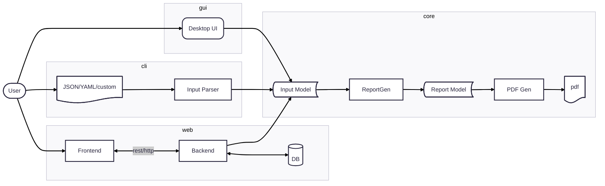

# Overall architecture

```mermaid
---
config:
  theme: redux
  look: classic
---
flowchart LR
 subgraph web["web"]
        db["DB"]
        backend["Backend"]
        frontend["Frontend"]
  end
 subgraph gui["gui"]
        desktop("Desktop UI")
  end
 subgraph cli["cli"]
        parser["Input Parser"]
        file["JSON/YAML/custom"]
  end
 subgraph core["core"]
        im["Input Model"]
        rm["Report Model"]
        report_gen["ReportGen"]
        pdf["pdf"]
        pdf_gen["PDF Gen"]
  end
    frontend <-- rest/http --> backend
    backend <--> db
    file --> parser
    im --> report_gen
    report_gen --> rm
    rm --> pdf_gen
    pdf_gen --> pdf
    user(["User"]) --> frontend & desktop & file
    backend --> im
    desktop --> im
    parser --> im
    db@{ shape: db}
    file@{ shape: doc}
    im@{ shape: stored-data}
    rm@{ shape: stored-data}
    pdf@{ shape: doc}
```
